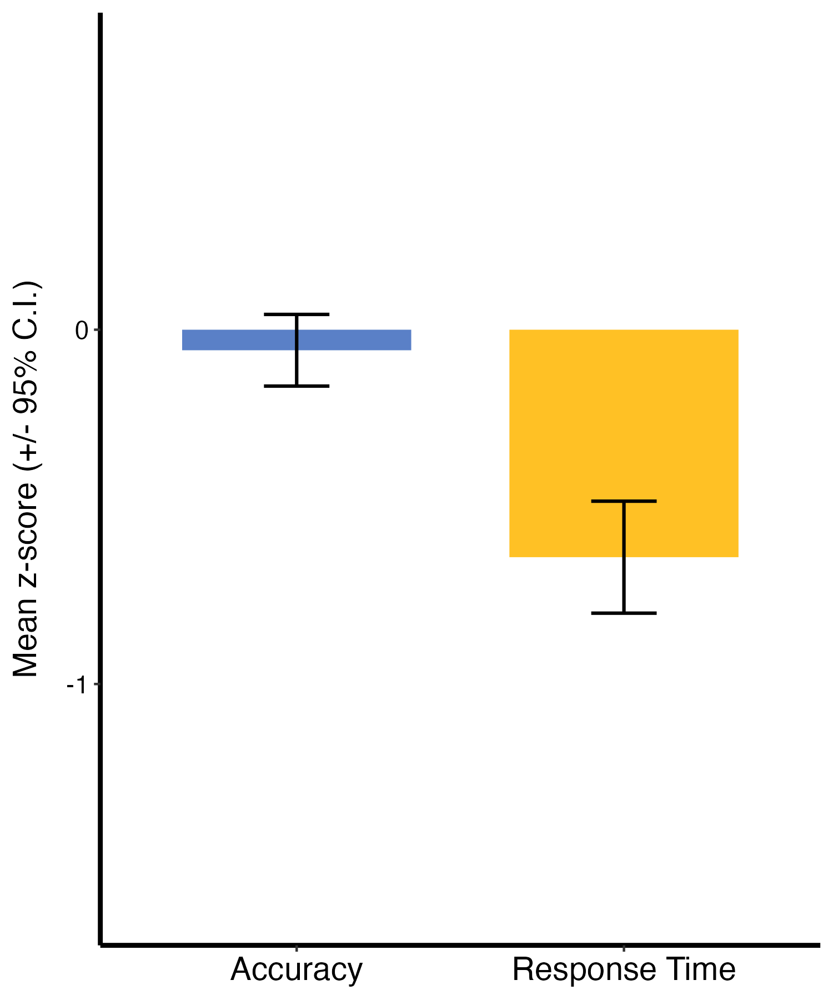
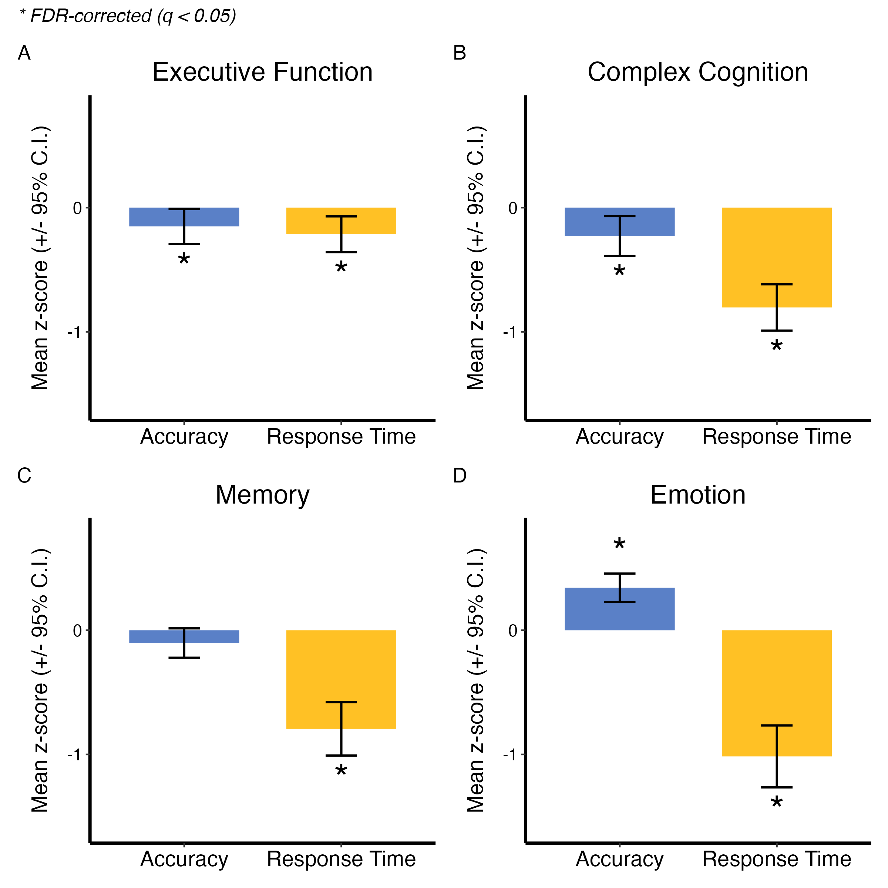
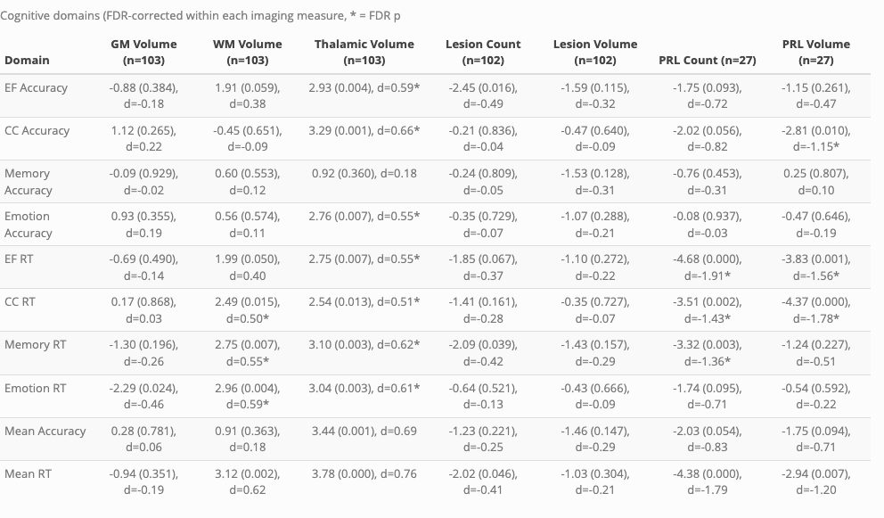

 
 

### Project Lead
Erica B. Baller

### Brief Project Description:
125 participants with MS were included (75.8%F, mean age 43.1). Cognitive assessments with CNB were performed and summarized by overall accuracy and speed, and by cognitive domain. Patterns of cognitive disease were then evaluated in relation to lesion burden (count and volume, n=102), GM, WM, and thalamic volume (n=103) from research-grade clinical scans, and PRL burden (count and volume, n=27) from 7T. 

### Authors/Collaborators:
Erica B. Baller, M.D., M.S., Elizabeth A. Horwath, Ph.D., Millie R. Sach, B.A., Elena C. Cooper, B.A., Nikka Bakhtiar, M.S., Amit Bar-Or, M.D., Rachel B. Brandstadter, M.D., Ruben C. Gur, Ph.D., Dina A. Jacobs, M.D., Christopher M. Perrone, M.D., David R. Roalf, Ph.D., Kosha Ruparel, M.S.E., J. Cobb Scott, Ph.D., Theodore D. Satterthwaite, M.D., M.A., Russell T. Shinohara, Ph.D., Matthew K. Schindler, M.D., Ph.D. 

### Project Start Date:
4/2026

### Current Project Status:
Completed

### Dataset:
K23 Multiple Sclerosis Cohort (collected between July 1, 2023 and April 30, 2026)

### Github repo:
[https://github.com/Baller-Lab/ms_cnb_2026/](https://github.com/Baller-Lab/ms_cnb_2026)

### Website
[https://Baller-Lab.github.io/ms_cnb_2026/](https://Baller-Lab.github.io/ms_cnb_2026)

### Slack Channel:
#ms-lesion_count_and_mimosa

### Zotero library:
K23 MS and Depression

### Current work products:
ECTRIMS 2026 Poster - "Domain-Specific Cognitive Impairments Identified by the Penn Computerized Neurocognitive Battery Are Associated with Paramagnetic Rim Lesion Burden"

### Path to Data on Filesystem **PMACS**

MS Proviers (local computer): 

     ~Box/BBL/general_emr_relevant_spreadsheets//msproviders.csv
     
Medication information: 
     
     [ms_medications_brand_and_generic](https://github.com/Baller-Lab/ms_cnb_2026/tree/main/medications/ms_medications_brand_and_generic.csv) 

Subject imaging data (cluster): 

     /project/msdepression/data/radiology_pulls_20260610/data/

Cubids (cluster): 

     Scripts: /project/msdepression/data/radiology_pulls_20260610/code/cubids
     Outputs: 
     1. /project/msdepression/data/radiology_pulls_20260610/data/other_data/v
0_files_pull_1_proj60
     2. /project/msdepression/data/radiology_pulls_20260610/data/other_data/v
0_files_pull_2_proj66
     
Volume of all lesions for each subject: 

     /project/msdepression/results/vol_mimosa_lesions/mimosa_volume_values_n105_20260702_094134.csv

 
 

# CODE DOCUMENTATION

**The analytic workflow implemented in this project is described in detail in the following sections. Analysis steps are described in the order they were implemented; the script(s) used for each step are identified and links to the code on github are provided.** 
 

### * Functions for project *

[msdep_prospective_functions.R](https://github.com/Baller-Lab/ms_cnb_2026/tree/main/scripts/msdep_prospective_functions.R)

### Sample Construction

We first constructed our sample from n=125 individuals who were diagnosed with multiple sclerosis by a Multiple Sclerosis provider and who had CNB. 

Of these, n=103 had good T1 scans that were used for FAST segmentation and thalamic segmentation. n=102 had good T1s and FLAIRs (one person had missing FLAIR). n=27 had PRL data. In our combining script, all data were combined in a spreadsheet (with CNB, demos), and deidentified. This output csv was then taken to the full analysis script. 

[make_combined_spreadsheet_for_cnb_paper.Rmd](https://github.com/Baller-Lab/ms_cnb_2026/tree/main/scripts/make_combined_spreadsheet_for_cnb_paper.Rmd)

### Automated white matter lesion segmentation

After we obtained our sample, we used the Method for Intermodal Segmentation Analysis (MIMoSA) to extract white matter lesions for each subject. MIMoSA has been previously described: 

Valcarcel AM, Linn KA, Vandekar SN, Satterthwaite TD, Muschelli J, Calabresi PA, Pham DL, Martin ML, Shinohara RT. MIMoSA: An Automated Method for Intermodal Segmentation Analysis of Multiple Sclerosis Brain Lesions. J Neuroimaging. 2018 Jul;28(4):389-398. [doi: 10.1111/jon.12506](https://pubmed.ncbi.nlm.nih.gov/29516669/). Epub 2018 Mar 8. PMID: 29516669; PMCID: PMC6030441.

After lesions were segmented with MIMoSA, we calculated the overall volume of white matter lesions. [get_volume_of_mimosa_lesions.sh](https://github.com/Baller-Lab/ms_cnb_2026/tree/main/scripts/lesion_volume/get_volume_of_mimosa_lesions.sh)

### Lesion Count

We then used the PennSIVE pipelines to do lesion count:
[run_lesion_count.sh](https://github.com/Baller-Lab/ms_cnb_2026/tree/main/scripts/lesion_count/run_lesion_count.sh)

And tabulate the results in a .csv.
[create_lesion_count_csv.sh](https://github.com/Baller-Lab/ms_cnb_2026/tree/main/scripts/lesion_count/create_lesion_count_csv.sh)

### Brain segmentation

To obtain a measure of total brain volume (minus CSF), I used FSL's fast on all T1w images (post n4 and ws). I then summed the grey matter and white matter volume to create a measure of total brain volume (total_volume).

Wrapper script:
[get_fast_total_brain_volume_all_subjs.sh](https://github.com/Baller-Lab/ms_cnb_2026/tree/main/scripts/fast/get_fast_total_brain_volume_all_subjs.sh)

Segmentation script:
[make_fast_files_single_subj_pmacs.sh](https://github.com/Baller-Lab/ms_cnb_2026/tree/main/scripts/fast/make_fast_files_single_subj.sh)

Volume calculation script:
[make_fast_volume_csv.sh](https://github.com/Baller-Lab/ms_cnb_2026/tree/main/scripts/fast/make_fast_volume_csv.sh)

### Thalamus Segmentation

We then used Openmap_t1 to obtain thalamic segmentations. See https://github.com/OishiLab/OpenMAP-T1 for more info, Nishimaki, K., Onda, K., Ikuta, K., Chotiyanonta, J., Uchida, Y., Mori, S., Iyatomi, H., Oishi, K., Alzheimer's Disease Neuroimaging Initiative and Australian Imaging Biomarkers and Lifestyle Flagship Study of Ageing (2024), OpenMAP-T1: A Rapid Deep-Learning Approach to Parcellate 280 Anatomical Regions to Cover the Whole Brain. Hum Brain Mapp, 45: e70063. https://doi-org.proxy.library.upenn.edu/10.1002/hbm.70063. 

Wrapper used to call individual segmentation scripts to run in parallel
[openmap_t1_wrapper.sh](https://github.com/Baller-Lab/ms_cnb_2026/tree/main/scripts/openmap_t1_project_scripts/openmap_t1_wrapper.sh)

Individual segmentation script
[indiv_openmap_t1_script.sh](https://github.com/Baller-Lab/ms_cnb_2026/tree/main/scripts/openmap_t1_project_scripts/indiv_openmap_t1_script.sh)

Assemble all thalamic segmentations into a csv
[assemble_openmap_t1_volumes.sh](https://github.com/Baller-Lab/ms_cnb_2026/tree/main/scripts/openmap_t1_project_scripts/assemble_openmap_t1_volumes.sh)

### PRL preprocessing

### Final group level analysis

This script is run locally, on R. It does all second level/group data analysis. Main steps summarized below.

[cnb_lesion_structural_prl_final_analyses_pre_replication_20260818.Rmd](https://github.com/Baller-Lab/ms_cnb_2026/tree/main/scripts/cnb_lesion_structural_prl_final_analyses_pre_replication_20260818.Rmd)

#### Overall Cognitive Results

#### Cognitive Results by Domain

#### Cognitive Results by Domain vs Lesion, GM, WM, Thalamus, and PRL Metrics

