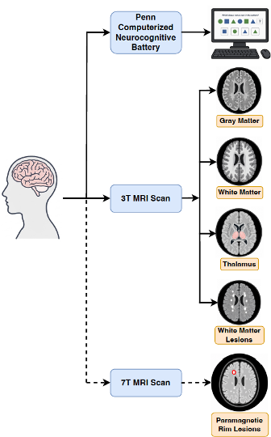
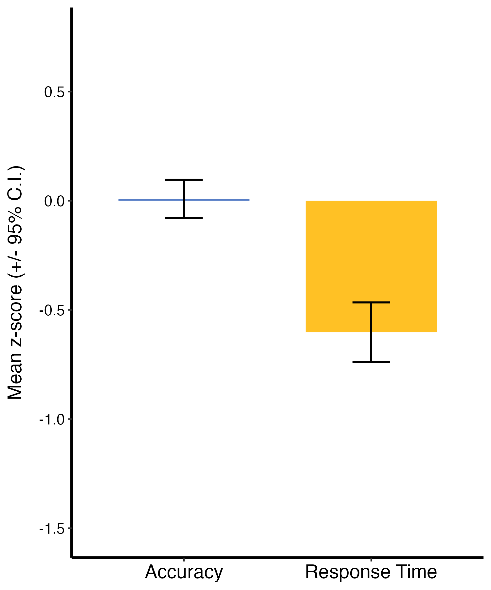
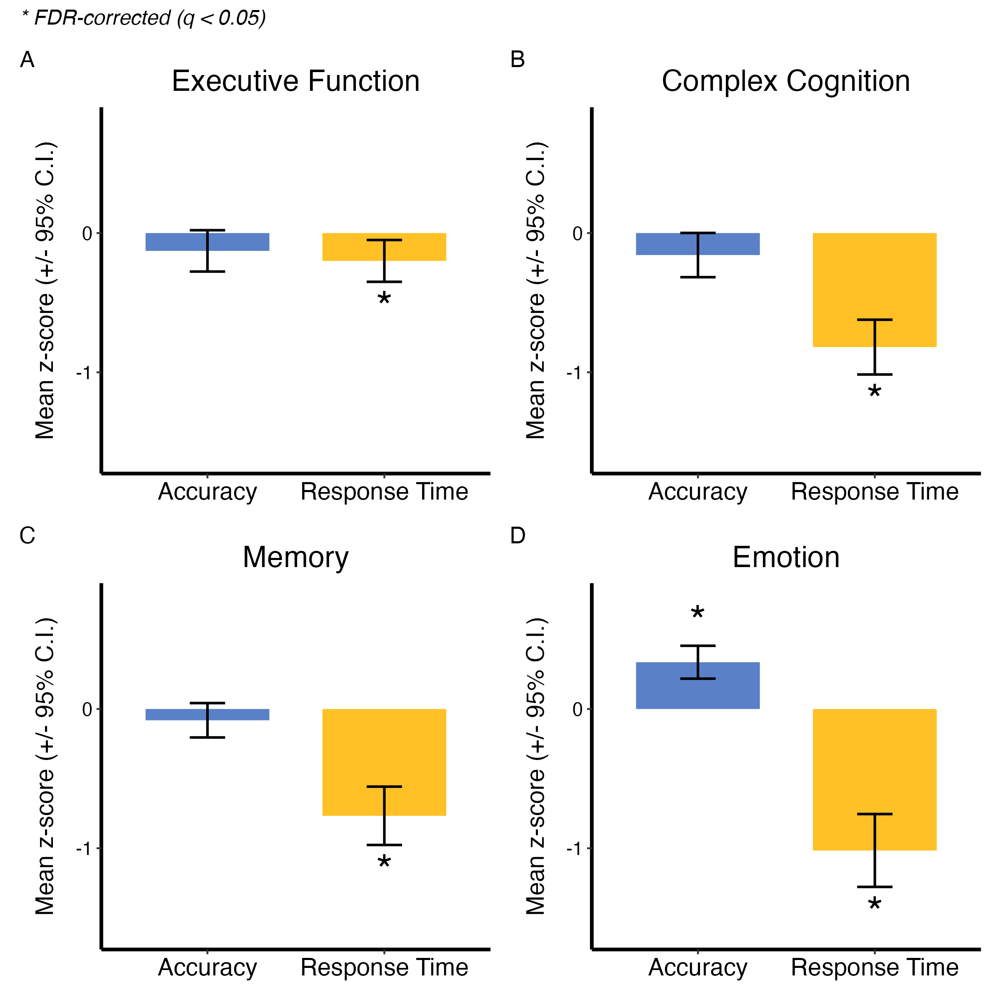
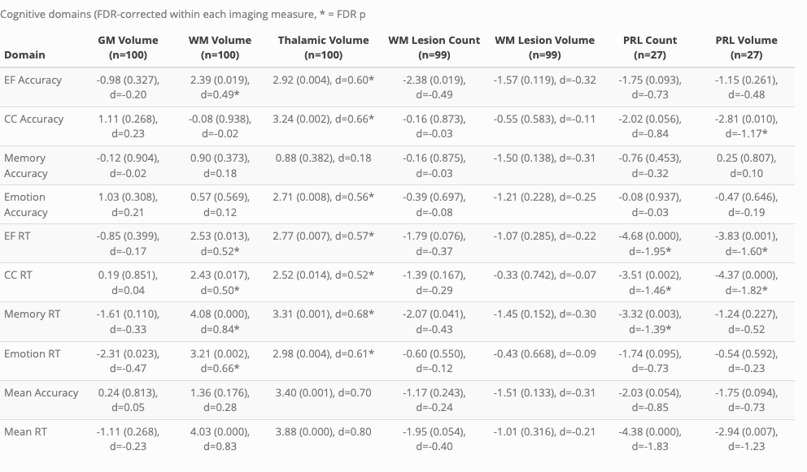
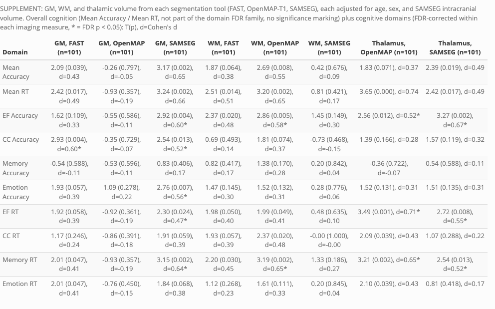
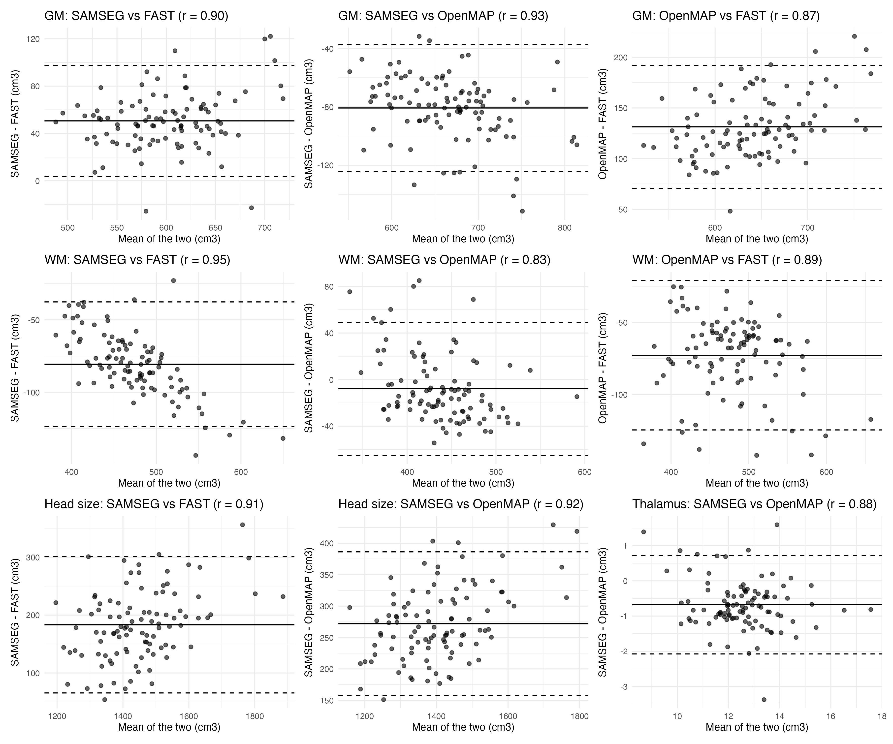

 
 

### Project Lead
Erica B. Baller

### Brief Project Description:
153 participants with MS were included (77%F, mean age 43.3). Cognitive assessments with CNB were performed and summarized by overall accuracy and speed, and by cognitive domain. Patterns of cognitive disease were then evaluated in relation to white matter lesion burden (count and volume, n=99) and thalamic volume (n=101) from research-grade clinical 3T scans, and PRL burden (count and volume, n=27) from 7T. Gray and white matter volume associations with cognition were not consistent across segmentation tools (SAMSEG, OpenMAP-T1, FSL FAST), so they are reported only as a supplementary method comparison.

### Authors/Collaborators:
Erica B. Baller, M.D., M.S., Elizabeth A. Horwath, Ph.D., Millie R. Sach, B.A., Elena C. Cooper, B.A., Nikka Bakhtiar, M.S., Amit Bar-Or, M.D., Rachel B. Brandstadter, M.D., Ruben C. Gur, Ph.D., Dina A. Jacobs, M.D., Steven Meisler, Ph.D., Christopher M. Perrone, M.D., David R. Roalf, Ph.D., Kosha Ruparel, M.S.E., J. Cobb Scott, Ph.D., Theodore D. Satterthwaite, M.D., M.A., Russell T. Shinohara, Ph.D., Matthew K. Schindler, M.D., Ph.D.

### Project Start Date:
4/2026

### Current Project Status:
Completed

### Dataset:
K23 Multiple Sclerosis Cohort (collected between July 1, 2023 and April 30, 2026)

### Github repo:
[https://github.com/Baller-Lab/ms_cnb_2026/](https://github.com/Baller-Lab/ms_cnb_2026)

### Website
[https://Baller-Lab.github.io/ms_cnb_2026/](https://Baller-Lab.github.io/ms_cnb_2026)

### Slack Channel:
#ms-lesion_count_and_mimosa

### Zotero library:
K23 MS and Depression

### Current work products:
ECTRIMS 2026 Poster - "Domain-Specific Cognitive Impairments Identified by the Penn Computerized Neurocognitive Battery Are Associated with Paramagnetic Rim Lesion Burden"

### Path to Data on Filesystem **PMACS**

MS Providers (local computer):

     ~Box/BBL/general_emr_relevant_spreadsheets//msproviders.csv

Medication information:

[ms_medications_brand_and_generic](https://github.com/Baller-Lab/ms_cnb_2026/tree/main/medications/ms_medications_brand_and_generic.csv)

Subject imaging data (cluster):

     /project/msdepression/data/radiology_pulls_20260610/data/

Cubids (cluster):

     Scripts: /project/msdepression/data/radiology_pulls_20260610/code/cubids
     Outputs: /project/msdepression/data/radiology_pulls_20260610/data/other_data/v0_files_pull_1_proj60; /project/msdepression/data/radiology_pulls_20260610/data/other_data/v0_files_pull_2_proj66

Imaging pipeline scripts (cluster):

     /project/msdepression/scripts/{mimosa,samseg,openmap_t1,fast}_project_scripts/

Imaging results (cluster):

     Lesion volume:          /project/msdepression/results/vol_mimosa_lesions/mimosa_volume_values_n105_20261009_155717.csv
     Lesion count:           /project/msdepression/results/lesion_count_n104.csv
     SAMSEG (thalamus, ICV): /project/msdepression/results/samseg_volumes_n105_from_samseg_t1.csv
     OpenMAP-T1:             /project/msdepression/results/all_volumes_n105_from_openmap_t1.csv
     FSL FAST:               /project/msdepression/results/total_fast_brain_volumes_hdbet_n105.csv

 
 

# CODE DOCUMENTATION

**The analytic workflow implemented in this project is described in detail in the following sections. Analysis steps are described in the order they were implemented; the script(s) used for each step are identified and links to the code on github are provided.**
 

The imaging scripts ran on the PMACS LSF cluster. Each pipeline folder has a README with its run order, and every wrapper takes an optional subject list ("sub_id,ses_id" per line, no header) as its first argument. See [scripts/README.md](https://github.com/Baller-Lab/ms_cnb_2026/tree/main/scripts/README.md) for an overview.

### * Functions for project *

[mscnb_functions.R](https://github.com/Baller-Lab/ms_cnb_2026/tree/main/scripts/mscnb_functions.R)

### Sample Construction

We first constructed our sample from individuals who were diagnosed with multiple sclerosis by a Multiple Sclerosis provider and who completed the CNB. After removing practice/test sessions and excluded participants, and keeping each participant's first CNB session, 159 participants had CNB, demographic (Oracle), and REDCap data; 153 of them completed every CNB task used in the domain scores and form the analytic sample.

### Skull stripping

T1-weighted images were skull-stripped with HD-BET, which was used in place of the default BET skull strip where BET failed:

[run_hdbet_skullstripping.sh](https://github.com/Baller-Lab/ms_cnb_2026/tree/main/scripts/mimosa_project_scripts/run_hdbet_skullstripping.sh)

### Automated white matter lesion segmentation

We used the Method for Intermodal Segmentation Analysis (MIMoSA) to extract white matter lesions for each subject. MIMoSA has been previously described:

Valcarcel AM, Linn KA, Vandekar SN, Satterthwaite TD, Muschelli J, Calabresi PA, Pham DL, Martin ML, Shinohara RT. MIMoSA: An Automated Method for Intermodal Segmentation Analysis of Multiple Sclerosis Brain Lesions. J Neuroimaging. 2018 Jul;28(4):389-398. [doi: 10.1111/jon.12506](https://pubmed.ncbi.nlm.nih.gov/29516669/). Epub 2018 Mar 8. PMID: 29516669; PMCID: PMC6030441.

[run_mimosa.sh](https://github.com/Baller-Lab/ms_cnb_2026/tree/main/scripts/mimosa_project_scripts/run_mimosa.sh)

After lesions were segmented with MIMoSA, we calculated the overall volume of white matter lesions:

[get_volume_of_mimosa_lesions.sh](https://github.com/Baller-Lab/ms_cnb_2026/tree/main/scripts/mimosa_project_scripts/get_volume_of_mimosa_lesions.sh)

### Lesion Count

We then used the PennSIVE pipelines to do lesion count:

[run_lesion_count.sh](https://github.com/Baller-Lab/ms_cnb_2026/tree/main/scripts/mimosa_project_scripts/run_lesion_count.sh)

And tabulate the results in a .csv:

[create_lesion_count_csv.sh](https://github.com/Baller-Lab/ms_cnb_2026/tree/main/scripts/mimosa_project_scripts/create_lesion_count_csv.sh)

### Thalamic volume and intracranial volume (SAMSEG)

Thalamic volume and intracranial volume (ICV) were obtained with SAMSEG (Sequence Adaptive Multimodal SEGmentation, FreeSurfer 7.4.1 container), run on the T1-weighted images. SAMSEG ICV includes all brain tissue and intracranial CSF, so it is a true measure of head size; it is the covariate for thalamic volume. Puonti O, Iglesias JE, Van Leemput K. Fast and sequence-adaptive whole-brain segmentation using parametric Bayesian modeling. NeuroImage. 2016;143:235-249.

Wrapper used to call individual segmentation scripts to run in parallel (one LSF array task per scan):

[samseg_wrapper.sh](https://github.com/Baller-Lab/ms_cnb_2026/tree/main/scripts/samseg_project_scripts/samseg_wrapper.sh)

Individual segmentation script:

[indiv_samseg_script.sh](https://github.com/Baller-Lab/ms_cnb_2026/tree/main/scripts/samseg_project_scripts/indiv_samseg_script.sh)

Assemble all SAMSEG volumes into a csv:

[assemble_samseg_volumes.sh](https://github.com/Baller-Lab/ms_cnb_2026/tree/main/scripts/samseg_project_scripts/assemble_samseg_volumes.sh)

Container setup and license: [README_install.txt](https://github.com/Baller-Lab/ms_cnb_2026/tree/main/scripts/samseg_project_scripts/README_install.txt)

### Segmentation method comparison (supplement)

To check whether imaging-cognition associations depended on the segmentation tool, gray matter (GM), white matter (WM), and thalamic volume were also obtained with two other tools, and all three were compared. Thalamic volume associations were consistent across tools; GM and WM associations were not, so GM and WM are reported only in the supplement.

OpenMAP-T1 (280-region deep-learning parcellation; thalamus and GM/WM totals). See https://github.com/OishiLab/OpenMAP-T1 for more info. Nishimaki, K., Onda, K., Ikuta, K., Chotiyanonta, J., Uchida, Y., Mori, S., Iyatomi, H., Oishi, K., Alzheimer's Disease Neuroimaging Initiative and Australian Imaging Biomarkers and Lifestyle Flagship Study of Ageing (2024), OpenMAP-T1: A Rapid Deep-Learning Approach to Parcellate 280 Anatomical Regions to Cover the Whole Brain. Hum Brain Mapp, 45: e70063. https://doi.org/10.1002/hbm.70063.

[openmap_t1_wrapper.sh](https://github.com/Baller-Lab/ms_cnb_2026/tree/main/scripts/openmap_t1_project_scripts/openmap_t1_wrapper.sh) (wrapper), [indiv_openmap_t1_script.sh](https://github.com/Baller-Lab/ms_cnb_2026/tree/main/scripts/openmap_t1_project_scripts/indiv_openmap_t1_script.sh) (individual), [assemble_openmap_t1_volumes.sh](https://github.com/Baller-Lab/ms_cnb_2026/tree/main/scripts/openmap_t1_project_scripts/assemble_openmap_t1_volumes.sh) (assemble)

FSL FAST (GM/WM/CSF, partial-volume weighted, on the HD-BET skull-stripped, bias-corrected T1):

[get_fast_total_brain_volume_all_subjs.sh](https://github.com/Baller-Lab/ms_cnb_2026/tree/main/scripts/fast_project_scripts/get_fast_total_brain_volume_all_subjs.sh) (wrapper), [make_fast_files_single_subj.sh](https://github.com/Baller-Lab/ms_cnb_2026/tree/main/scripts/fast_project_scripts/make_fast_files_single_subj.sh) (individual), [make_fast_volume_csv.sh](https://github.com/Baller-Lab/ms_cnb_2026/tree/main/scripts/fast_project_scripts/make_fast_volume_csv.sh) (assemble)

### PRL preprocessing

### Combining groups
Of the n=153 in our sample, n=101 had usable 3T T1 scans, used for thalamic volume and ICV. n=99 had usable lesion segmentations (one participant had poor lesion segmentation and one did not have a usable FLAIR). n=27 had PRL data from 7T. In our combining script, all data were combined in a spreadsheet (with CNB, demos), and deidentified. This output csv was then taken to the full analysis script.

[make_combined_spreadsheet_for_cnb_paper_post_replication_full_cnb_csv.Rmd](https://github.com/Baller-Lab/ms_cnb_2026/blob/main/scripts/make_combined_spreadsheet_for_cnb_paper_post_replication_full_cnb_csv.Rmd)

### Final group level analysis

This script is run locally, on R. It does all second level/group data analysis. All models are adjusted for age and sex; thalamic volume models are also adjusted for SAMSEG ICV. Domain-level results are FDR-corrected across the 8 domain outcomes within each imaging measure.

[cnb_lesion_structural_prl_final_analyses_post_replication_20260917.Rmd](https://github.com/Baller-Lab/ms_cnb_2026/tree/main/scripts/cnb_lesion_structural_prl_final_analyses_post_replication_20260917.Rmd)

#### Overall Cognitive Results

#### Cognitive Results by Domain

#### Cognitive Results by Domain vs Thalamic Volume, WML, and PRL Metrics

#### Supplement: GM, WM, and Thalamic Volume by Segmentation Tool

